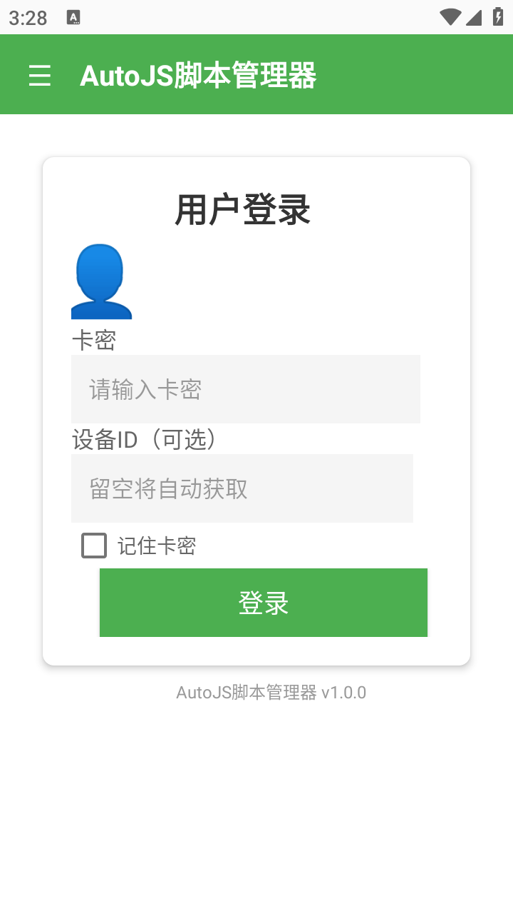
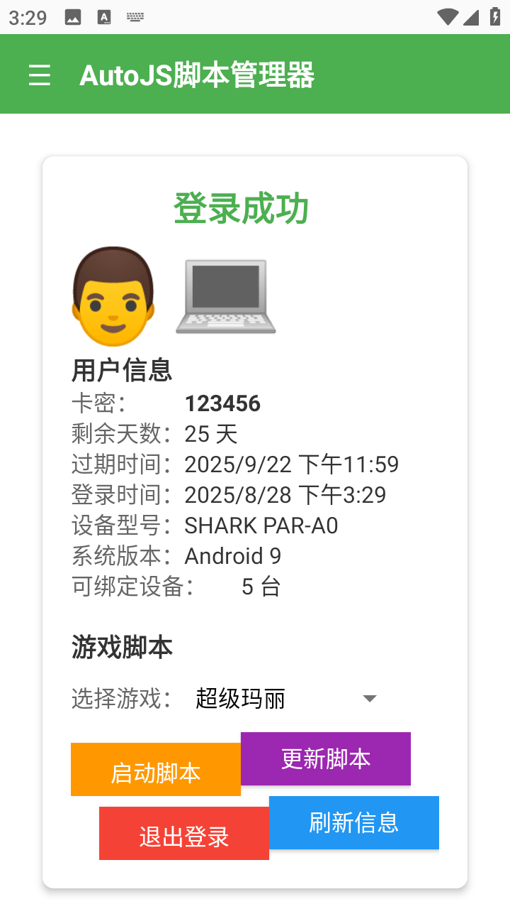
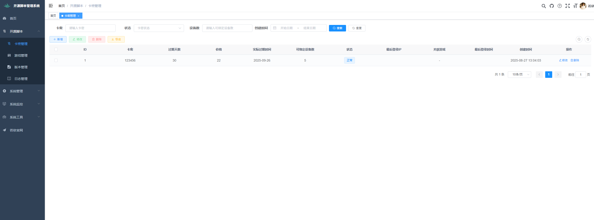
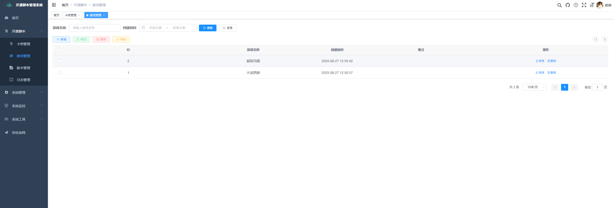
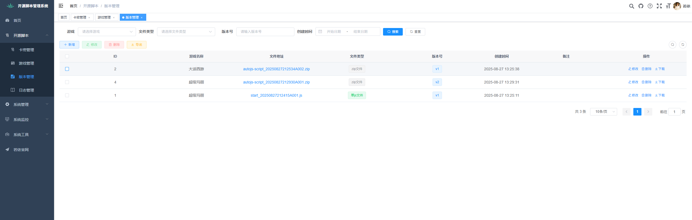
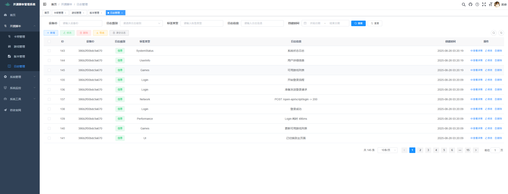

# AutoJS脚本管理框架

<p align="center">
  
</p>
<h1 align="center" style="margin: 30px 0 30px; font-weight: bold;">AutoJS脚本管理框架 v1.0.0</h1>
<h4 align="center">基于若依(RuoYi) + AutoJS6的完整脚本管理解决方案</h4>

## 📖 项目简介

AutoJS脚本管理框架是一套完整的脚本管理解决方案，包含**AutoJS6客户端**、**若依后台管理系统**和**Spring Boot后端API**。系统支持卡密认证、脚本版本管理、设备管理、日志收集等功能，为AutoJS脚本的商业化运营提供完整的技术支撑。

## 🏗️ 系统架构

```
open-script-ruoyi/
├── autojs-script/          # AutoJS6客户端脚本
├── open-script/            # 脚本管理后端模块
├── ruoyi-admin/            # 若依主应用
├── ruoyi-ui/              # Vue前端管理界面
├── ruoyi-common/          # 通用工具模块
├── ruoyi-framework/       # 框架核心模块
├── ruoyi-system/          # 系统管理模块
└── sql/                   # 数据库脚本
```

## ✨ 核心功能

### 🎯 AutoJS客户端功能
- **卡密登录认证** - 支持卡密验证和设备绑定
- **游戏脚本管理** - 动态加载和运行不同游戏脚本
- **版本自动更新** - 自动检测和下载最新脚本版本
- **设备信息同步** - 自动上报设备信息和运行状态
- **日志远程上传** - 实时上传运行日志到服务器
- **权限自动检测** - 智能检测和申请必要的系统权限

### 🎮 后台管理功能
- **卡密管理** - 卡密生成、分配、状态管理
- **游戏管理** - 游戏信息维护和脚本关联
- **版本控制** - 脚本版本发布和历史管理
- **设备管理** - 设备信息查看和状态监控
- **日志分析** - 远程日志收集和分析
- **用户权限** - 基于若依的完整权限管理体系

## 🚀 技术栈

### 前端技术
- **Vue 2.x** - 渐进式JavaScript框架
- **Element UI** - Vue组件库
- **Axios** - HTTP客户端

### 后端技术
- **Spring Boot 2.x** - 微服务框架
- **Spring Security** - 安全框架
- **MyBatis** - 持久层框架
- **MySQL** - 关系型数据库
- **Redis** - 缓存数据库

### 客户端技术
- **AutoJS6** - Android自动化脚本引擎
- **JavaScript ES6+** - 脚本开发语言

## 📦 快速开始

### 环境要求
- **JDK 8+** 
- **MySQL 5.7+**
- **Redis 3.2+**
- **Node.js 14+**
- **AutoJS6** (Android端)

### 1. 数据库初始化
```bash
# 导入基础数据库
mysql -u root -p < sql/ry_20250522.sql

# 导入脚本管理模块数据
mysql -u root -p < sql/script_card.sql
```

### 2. 后端部署
```bash
# 修改数据库配置
# 编辑 ruoyi-admin/src/main/resources/application-druid.yml

# 编译打包
mvn clean package

# 运行应用
java -jar ruoyi-admin/target/ruoyi-admin.jar
```

### 3. 前端部署
```bash
cd ruoyi-ui

# 安装依赖
npm install

# 开发环境运行
npm run dev

# 生产环境构建
npm run build:prod
```

### 4. AutoJS客户端配置
```javascript
// 修改 autojs-script/modules/config.js 中的服务器地址
let API_CONFIG = {
    BASE_URL: "http://your-server:8080",  // 修改为您的服务器地址
    // ...其他配置
};
```

## 📱 AutoJS客户端详解

### 核心模块

#### 🔧 配置管理 (`modules/config.js`)
- **API配置** - 服务器地址和接口端点
- **日志配置** - 本地存储和远程上传设置
- **应用配置** - 基础应用信息和存储键名

#### 🌐 HTTP工具 (`modules/http-utils.js`)
- **请求封装** - GET/POST请求统一处理
- **认证管理** - Token自动添加和刷新
- **错误处理** - 网络异常和业务异常处理

#### 📝 日志系统 (`modules/logger.js` & `modules/logger-integration.js`)
- **多级日志** - DEBUG/INFO/WARN/ERROR级别
- **本地存储** - 自动文件分割和清理
- **远程上传** - 批量上传到服务器
- **环境适配** - 开发/生产环境不同配置

#### 🎮 主应用 (`main.js`)
- **用户界面** - Material Design风格界面
- **登录认证** - 卡密验证和设备绑定
- **脚本管理** - 游戏选择和脚本运行
- **版本更新** - 自动检测和下载更新

### 界面预览

#### 登录界面
- 卡密输入和验证

- 记住登录状态
- 设备信息显示


#### 主界面
- 游戏列表展示
- 脚本运行控制
- 日志实时显示
- 设置和帮助

## 🏢 后端API详解

### 脚本管理模块 (`open-script`)

#### 📋 核心实体
- **ScriptCard** - 卡密信息管理
- **ScriptGame** - 游戏信息管理  
- **ScriptVersionControl** - 版本控制管理
- **ScriptDevice** - 设备信息管理
- **ScriptLog** - 日志信息管理

#### 🔌 主要API接口
```java
// 登录认证
POST /open-api/script/login

// 卡密验证
POST /open-api/script/verify

// 获取游戏数据
GET /open-api/script/game-data

// 检查最新版本
GET /open-api/script/latest

// 上传日志
POST /open-api/script/logs/upload
```

## 🎨 前端管理界面

### 脚本管理模块

#### 🎯 卡密管理 (`ruoyi-ui/src/views/script/card/`)
- 卡密生成和批量操作
- 状态管理和过期控制
- 设备绑定查看

#### 🎮 游戏管理 (`ruoyi-ui/src/views/script/game/`)
- 游戏信息维护
- 脚本关联配置

#### 📦 版本管理 (`ruoyi-ui/src/views/script/version/`)
- 版本发布和历史
- 文件上传和下载
- 版本回滚功能

#### 📱 设备管理
- 设备信息查看
- 在线状态监控
- 设备绑定管理

#### 📊 日志管理 (`ruoyi-ui/src/views/script/log/`)
- 远程日志查看
- 日志级别筛选
- 日志导出功能




## 🗄️ 数据库设计

### 核心表结构

```sql
-- 卡密表
CREATE TABLE script_card (
    id BIGINT PRIMARY KEY AUTO_INCREMENT,
    card_no VARCHAR(20) UNIQUE NOT NULL COMMENT '卡密',
    expire_day INT NOT NULL COMMENT '过期天数',
    price DECIMAL(10,2) NOT NULL COMMENT '价格',
    device_size VARCHAR(50) DEFAULT '1' COMMENT '可绑定设备数',
    status CHAR(1) DEFAULT '0' COMMENT '状态'
);

-- 游戏表
CREATE TABLE script_game (
    id BIGINT PRIMARY KEY AUTO_INCREMENT,
    title VARCHAR(100) NOT NULL COMMENT '游戏名称',
    status CHAR(1) DEFAULT '0' COMMENT '状态'
);

-- 版本控制表
CREATE TABLE script_version_control (
    id BIGINT PRIMARY KEY AUTO_INCREMENT,
    game_id BIGINT NOT NULL COMMENT '游戏ID',
    version INT NOT NULL COMMENT '版本号',
    file_url VARCHAR(500) NOT NULL COMMENT '文件地址',
    type TINYINT DEFAULT 0 COMMENT '文件类型'
);
```

## 🔧 开发指南

### 添加新游戏脚本

1. **后台添加游戏信息**
   ```
   系统管理 -> 脚本管理 -> 游戏管理 -> 新增
   ```

2. **上传脚本版本**
   ```
   系统管理 -> 脚本管理 -> 版本管理 -> 新增版本
   ```

3. **客户端自动同步**
   - 客户端启动时自动获取游戏列表
   - 选择游戏时自动检查版本更新

### 自定义日志处理

```javascript
// 在AutoJS脚本中使用日志系统
let logger = require('./modules/logger-integration.js');

// 记录不同级别的日志
logger.debug("调试信息");
logger.info("普通信息");  
logger.warn("警告信息");
logger.error("错误信息");

// 记录网络请求
logger.logNetworkRequest(endpoint, method, statusCode, duration);
```

## 📋 部署说明

### 生产环境部署

1. **服务器配置**
   - CPU: 2核心以上
   - 内存: 4GB以上
   - 存储: 50GB以上

2. **数据库优化**
   ```sql
   -- 创建索引优化查询
   CREATE INDEX idx_card_no ON script_card(card_no);
   CREATE INDEX idx_device_android_id ON script_device(device_android_id);
   CREATE INDEX idx_log_create_time ON script_log(create_time);
   ```

3. **Nginx配置**
   ```nginx
   server {
       listen 80;
       server_name your-domain.com;
       
       location /api/ {
           proxy_pass http://127.0.0.1:8080/;
       }
       
       location / {
           root /var/www/ruoyi-ui/dist;
           try_files $uri $uri/ /index.html;
       }
   }
   ```

## 🤝 贡献指南

1. Fork 本仓库
2. 创建您的特性分支 (`git checkout -b feature/AmazingFeature`)
3. 提交您的修改 (`git commit -m 'Add some AmazingFeature'`)
4. 推送到分支 (`git push origin feature/AmazingFeature`)
5. 打开一个 Pull Request

## 📄 开源协议

本项目采用 MIT 许可证 - 查看 [LICENSE](LICENSE) 文件了解详情

## 📞 联系我们

- 项目地址：[GitHub Repository]
- 问题反馈：[Issues]
- 技术交流：欢迎加入技术交流群

## 🙏 致谢

- [若依(RuoYi)](https://gitee.com/y_project/RuoYi-Vue) - 提供优秀的后台管理框架
- [AutoJS6](https://github.com/SuperMonster003/AutoJs6) - 提供强大的Android自动化引擎
- 所有为本项目做出贡献的开发者

---

**注意**: 本项目仅供学习和研究使用，请遵守相关法律法规，不得用于违法违规用途。